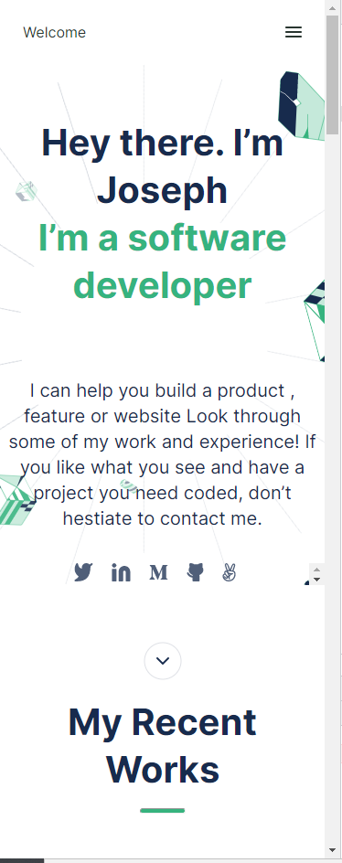
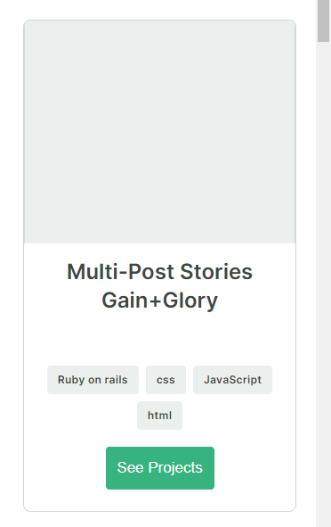
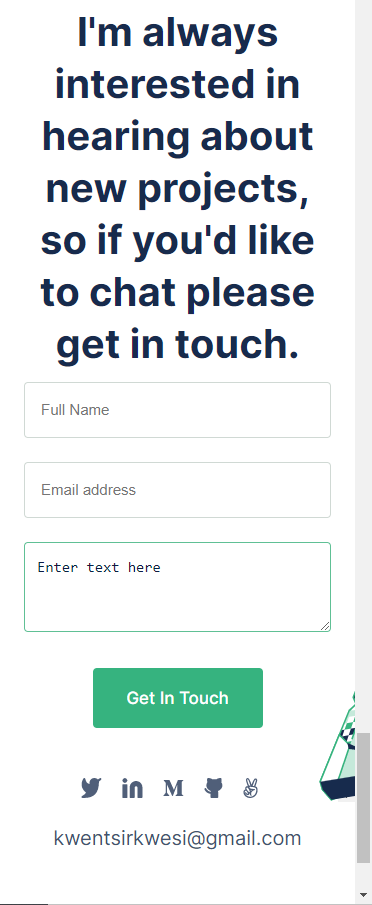

# Project Name : Joseph Kwesi Kwentsir Portfolio

>This is the mobile skeleton of my portfolio.

## Built With

- Major languages
  HTML and CSS
- Frameworks
- Technologies used

## Getting Started

To get a local copy up and running follow these simple example steps.

- Copy this link `https://github.com/Kwentsir/Kwentsir-Portfolio`.
- Get the directory that you want to clone the repository.
- Open the command prompt in this directory.
- Write `git clone https://github.com/Kwentsir/Kwentsir-Portfolio.git`.
- Go to the repository folder in your command prompt `cd Kwentsir-Portfolio`.
- Run `npm install` to install the dev dependencies for linters.

## Viewing Site
To view the complete site, please follow the link below.
https://kwentsir.github.io/kwentsir-Portfolio/

## Authors 

👤 **Author1**
Joseph Kwesi Kwentsir

- GitHub: [@githubhandle](https://github.com/kwentsir)
- Twitter: [@twitterhandle](https://twitter.com/jkwentsir)
- LinkedIn: [LinkedIn](https://linkedin.com/in/josephkwentsir)

👤 **Author2**
NOUREDDINE MEZIANY

- GitHub: [@githubhandle](https://github.com/githubhandle)
- Twitter: [@twitterhandle](https://twitter.com/twitterhandle)
- LinkedIn: [LinkedIn](https://linkedin.com/in/linkedinhandle)

## 🤝 Contributing

Contributions, issues, and feature requests are welcome!

Feel free to check the [issues page](../../issues/).

## Show your support

Give a ⭐️ if you like this project!

## 📝 License

This project is [MIT](./MIT.md) licensed.
